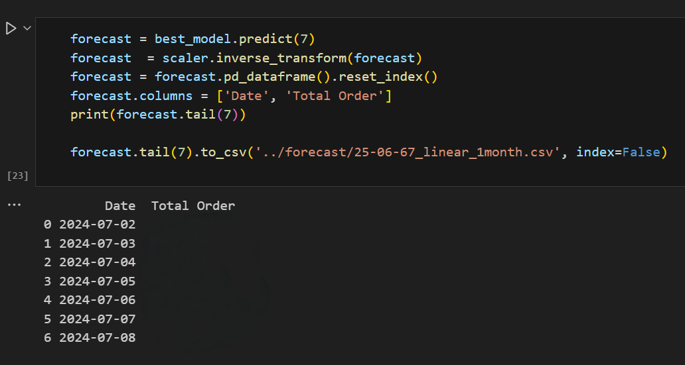
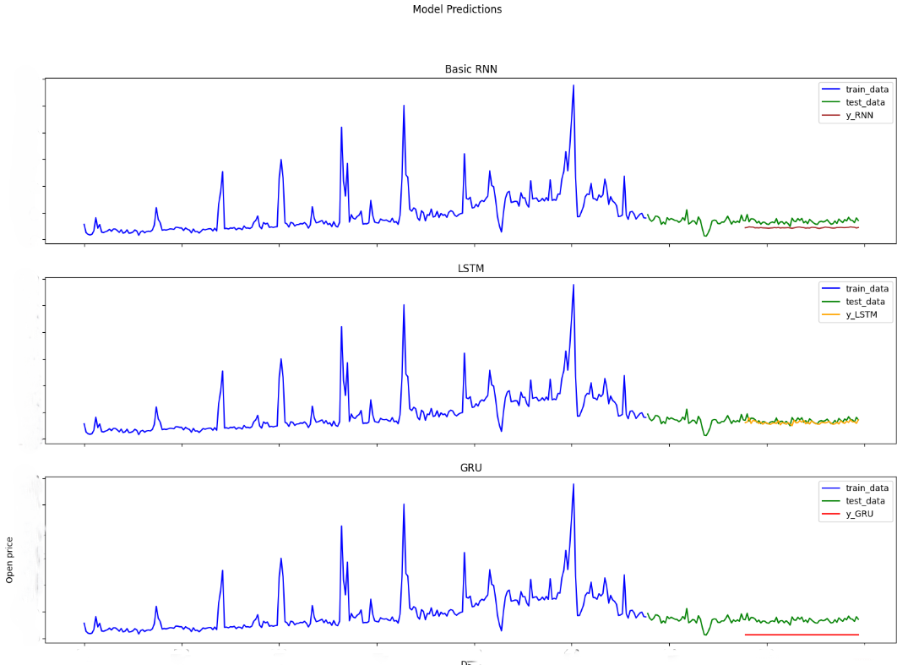
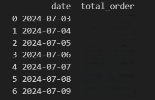

# Forecast No. of Orders TalaadThai intership 2024
This project is Machine Learning Project, forecasting number of orders TalaadThai. The idea is use time series model to forecast/future predict number of orders. The models are Regression Models, Statistic Models and Deep Learning Models Create By Mr. Polakorn Anantapakorn MUICT student year 2.  

## QR Code


## Datasets
### Provided dataset 
เราใช้ข้อมูลเกี่ยวกับรายการคำสั่งซื้อ โดยข้อมูล Query จาก PostgresSQL Database ข้อมูล Dataset จะอยู่ภายใน Folder "csv" ไฟล์ข้อมูลจะเป็นรูปแบบ CSV ที่ประกอบไปด้วยคอลัมน์ order_completed_at แสดงถึงข้อมูลวันเดือนปี และคอลัมน์ unique_order_count แสดงถึงจำนวนรายการสินค้าในวันเดือนปีนั้น ช่วงวันที่ข้อมูล datatset 2023-01-01 ถึง 2024-07-02 (ปี-เดือน-วัน)

## Project Structure

```

D:.
├───deepLearning_model
│   ├───best_check
│   └───weights_check
└───timeSeries_model
    ├───csv
    │   └───total_orderJun67
    ├───forecast
    │   ├───predict-19Jun67
    │   ├───predict-20Jun67
    │   ├───predict-21Jun67
    │   ├───predict-25Jun67
    │   ├───predict-2Jul67
    │   └───usePredict
    ├───model
    ├───model_old
    │   ├───catboost
    │   ├───exponentialSmooth
    │   ├───lightGBM
    │   ├───linearReg
    │   ├───model_25Jun67
    │   ├───prophet
    │   └───randomForest
    ├───notebook
    └───notebook_old

```

Folder Project ประกอบไปด้วย Folder Time Series Model ที่จะเป็นไปด้วย Statistic Model และ Regression Model และ Dataset ที่ใช้งาน ถัดมาเป็น Deep Learning Model ที่จัดเก็บ Deep Learning Model

### ประเภทไฟล์เบื้องต้น
1. ไฟล์ที่คำขึ้นต้นด้วย train_.ipynb หรือ demo_.ipynb จะเป็นประเภทไฟล์พัฒนา ML(Mahchine Learning) Model และทดสอบ Model รวมถึงการเรียก Model ทำนายผลลัพท์
2. ไฟล์ที่ลงท้ายนามสกุล .keras เป็น Model ที่พัฒนาบันทึกได้จัดเก็บไว้ภายใน Folder ต่างๆ (Folder Model และ Model_old) สามารถเรียกใช้เพื่อนำไปพัฒนาต่อยอด หรือ เรียกใช้นำมาทำนายผลได้
3. ไฟล์ประเภท csv ที่อาจจะเป็นไฟล์ Dataset หรือ ไฟล์ Forecast ที่โมเดลทำนายผลลัพท์ออกมา (Folder csv จัดเก็บ Dataset, Folder forecast จัดเก็บผลทำนาย)

## Usage
### Requirements:

Project ที่จัดทำขึ้นนี้ Folder timeSeries_model และ deepLearning_model ใช้งาน Library ที่แตกต่างกันมีรายละเอียดดังนี้

หมายเหตุ ผู้จัดทำขอข้ามขั้นตอนการสร้าง Environment เพราะรายละเอียดของทั้งสอง Folder มีขั้นตอนและวิธีการแตกต่างกัน ผู้จัดทำจึงให้ช่องทางการสร้าง Environment ดังนี้

Folder timeSeries_model พัฒนาภายใน Anaconda Environment (conda environment)
https://www.youtube.com/watch?v=fnb4_MzpZFU

Folder deepLearning_model พัฒนาภายใน venv Environment
https://code.visualstudio.com/docs/python/environments#:~:text=To%20create%20local%20environments%20in,environment%20types%3A%20Venv%20or%20Conda.

#### timeSeries_model Important Libraries:
python 3.12.3
```
pandas==2.2.2
numpy==1.26.4
scikit-learn==1.5.0
seaborn==0.13.2
statsmodels==0.14.2
u8darts==0.29.0
u8darts-all==0.29.0
matplotlib-base==3.8.4
```

#### deepLearning_model Important Libraries:
python 3.10.11
```
keras==3.4.1
matplotlib==3.8.3
numpy==1.26.4
pandas==2.2.1
scikit-learn==1.4.1.post1
tensorflow==2.16.2
tensorflow-cpu==2.16.2
```


## วิธีการรันโปรเจ็ค 
การพัฒนาไฟล์โปรเจ็คพัฒนาอยู่บนไฟล์ .ipynb (่jupyter notebook) Programming language ที่ใช้งานคือ Python
ไฟล์ที่พัฒนาส่วนใหญ่ประกอบไฟด้วย Topic ต่างๆ ตามกระบวนการพัฒนา Machine Learning Model

## Machine Learning Process
ผู้จัดทำจะอธิบายขั้นตอนการพัฒนาโมเดลหัวข้อต่างๆ ( timeSerie Model [Statistic Model, Regression Model]  และ Deep Learning ตามลำดับ ) ที่ผู้จัดทำได้ดำเนินมามีรายละเอียดดังนี้

1. Import Data
2. Data Preprocessing and Feature Engineering
3. Modeling and Training Model
4. Evaluation
5. Result and Summary
6. ETC

### การนำเข้าข้อมูล (Import Data)
การนำเข้าข้อมูลเพื่อให้ Machine Learning เรียนรู้และทำนายผลลัพท์ ตัวอย่างการเรียกข้อมูล


### การวิเคราะห์ข้อมูลและการแปลงข้อมูล (Data Preprocessing)
ยกตัวอย่างเทคนิค Data Preprocessing ที่นำมาปรับใช้ภายในโปรเจ็คนี้

#### การเปลี่ยน Datatype:
การเปลี่ยน dataframe ซึ่งเป็นข้อมูลที่ได้จากการนำเข้าข้อมูล เปลี่ยนเป็น Time Series Object เนื่องจากการใช้งาน Darts Library จึงต้องเปลี่ยนข้อมูลให้เหมาะสม


#### การลบค่า Outiler (ค่าผิดปกติ):
การลบค่าผิดปกติของข้อมูลช่วยให้ Machine Learning เรียนรู้ได้เหมาะสมมากขึ้นและเรียนรู้ Pattern ของข้อมูลที่เหมาะสม
ตัวอย่างการนำค่าผิดปกติแทนค่าตัวค่ากลาง

***before remove outlier***


***after remove outlier***


#### Feature Scaling:
การปรับค่าข้อมูลให้มีขนาดช่วงระหว่าง 0 ถึง 1 เพื่อให้ Machine Learning และ Deep Learning เรียนรู้ได้ดียิ่งขึ้น


### Modeling and Training Model
การออกแบบโมเดลและพัฒนาโมเดล ให้มีความเหมาะสมกับข้อมูลที่เรียนรู้และการนำไปใช้งาน 
Library ที่ใช้พัฒนา ***"Darts"***


#### การแบ่งข้อมูลชุดเรียนรู้และข้อมูลชุดทดสอบ (Train Test Split)
การแบ่งข้อมูลที่ให้ Machine Learning เรียนรู้และข้อมูลที่ใช้สำหรับทดสอบ
ตัวอย่างการแบ่ง Train Test Split


#### Statistic Model และ Regression Model
ภาพตัวอย่าง การ train model ของ Linear Regression ที่กำหนดให้ Model ท้ายผล 1 สัปดาห์ โดยข้อมูล


#### GridSearch 
gridSearch คือ function ช่วยเหลือนักพัฒนาโมเดล ให้ผลลัพท์ Model ที่เหมาะสมที่สุด จากการทดลองกับ parameter ต่างๆของโมเดล เป็นวิธีการ Tuning Model อย่างหนึ่ง


### Evaluation
การทดสอบประสิทธิภาพโมเดล

#### Performance Metric
ค่าดัชนีที่ใช้วัดผลของ Machine Learning มีรายละเอียดเบื้องต้นดังนี้:

1. MAE, MSE ,RMSE เป็นค่าดัชนีที่ใช้วัดค่าความคลาดเคลื่อนมีสูตรการคำนวณที่แตกต่างกัน แต่โดยรวมมีจุดประสงค์ให้ผู้พัฒนาสามารถเห็นค่าเคลื่อนคลาด

2. MAPE เป็นค่าดัชนีใช้วัดค่าความคลาดเคลื่อนค่าเป็นร้อยละ (%) และ Accuracy เป็นค่าส่วนกลับของ MAPE (Accuracy = 100 - MAPE)


#### Evaluation Train Test Split
การทดสอบโมเดลกับข้อมูลชุดข้อมูลและนำมาเปรียบเทียบ ตัวอย่างการทดสอบ Linear Regression 


### Result and Summary
การสรุปผลโมเดลที่ได้ทดสอบ จากการทดสอบโมเดลได้ผลลัพท์โปรเจ็คในระยะแรกสามารถสรุปผลได้ดังนี้ 

 

สรุปผลจากกรณีการทดสอบ Split test 80:20 โมเดลประเภท Statistic สามารถ Prediction ได้ดีที่สุด คือ ***ARIMA model*** มีค่า MAE 19.702, MAPE 23.0647 %, MSE 811.9856

รายละเอียดการทดสอบโมเดลสามารถอ่านเพิ่มเติมได้ที่ไฟล์ ***Model_Evaluate.xlsx***

### ETC

#### การทำนาย (Future Prediction):
แสดงการเรียกใช้งาน Model และบันทึกผลการทำนายรูปแบบไฟล์ CSV



การบันทึกผลการทำนายรูปแบบ CSV จะถูกจัดเก็บภายใน Folder forecast


#### การเรียกใช้และบันทึกโมเดลที่พัฒนา (Save and Load Model)
ตัวอย่างการบันทึกและเรียกใช้งานโมเดล

***SAVE MODEL***


***LOAD MODEL***
เราสามารถ load model ผ่าน Darts Library หรือการอ่านไฟล์ Pickle 

การอ่านไฟล์ผ่าน Darts Library เรียกใช้ Static Method "Load"
โดยเรียกผ่าน Class Model ที่เราพัฒนา ตัวอย่างภาพเรียก Catboost Model  


การอ่านไฟล์ Pickle 


## Deep Learning Process
project ในระยะที่สองนี้ผู้พัฒนาได้ศึกษาและพัฒนา Deep Learning ประเภท RNN (
Recurrent neural network
), LSTM (Long-short Term Model) และ GRU (Gated recurrent unit)

### Import Data
วิธีการ Import Data ของ Deep Learning ไม่มีความแตกต่างจาก Statistic, Regression Model 


### Data preprocessing 

#### Deep Learning Train Test Split
การพัฒนา Deep Learning Model เนื่องจากผู้พัฒนาไม่ได้ใช้งาน Darts Library ในการพัฒนาจึงเขียนคำสั่งการแบ่งชุดข้อมูลดังนี้


#### Feature Scaling 
ขั้นตอนมีความสำคัญต่อการเรียนรู้ของ Deep Learning การเปลี่ยนช่วงข้อมูลให้โมเดล Deep Learning สามารถเรียนรู้ได้อย่างมีประสิทธิภาพ


#### Lags Feature
การนำข้อมูลอดีต จากวันที่สนใจ/เป้าหมาย จัดทำในรูปแบบคอลัมน์ที่บันทึกข้อมูลอดีต n จำนวนขึ้นกับจำนวน Lags
ตัวอย่าง


Credit: Feature Engineering for Time Series Forecasting - Kishan Manani
https://www.youtube.com/watch?v=2vMNiSeNUjI

ผู้พัฒนาได้ประยุกต์ใช้งาน Lags feature (Darts Library มีคำสั่งสำหรับจัดทำ Lags แต่การพัฒนา Deep Learning ผู้พัฒนาได้สร้างชุดคำสั่งการจัดทำ Lags ในรูปแบบ List) 


#### Reshape Data
การเปลี่ยนรูปร่าง/ มิติของข้อมูลเพื่อ Deep Learning เรียนรู้ การเปลี่ยนแปลงมิติข้อมูลโดยมีชุดคำสั่งดังนี้


ในขั้นตอนนี้ ผู้พัฒนาได้เปลี่ยนแปลงข้อมูล Format เพื่อ Input สำหรับ RNN Model จากเดิมที่มี 2 มิติ (samples, feature) เป็น 3 มิติ (samples, time steps[lags], feature)


### Deep Learning Modeling and Training
การพัฒนา Deep Learning Model ผู้พัฒนาได้อ้างอิงโครงสร้าง Layer จาก https://www.geeksforgeeks.org/time-series-forecasting-using-recurrent-neural-networks-rnn-in-tensorflow/

ตัวอย่าง LSTM Model Layer และ Optimizer ที่ใช้งาน


### Result and Metric Performance
ภาพการทดสอบ Deep Learning Model: RNN Model, LSTM Model, GRU Model



ผลค่าดัชนีการทดสอบ Deep Learning Model


### Summary Deep Learning Performance
สรุปจากการทดสอบ RNN Model, LSTM Model, GRU Model ผลคือ LSTM Model มีประสิทธิภาพมากที่สุดในค่า Metric ทุกค่าได้แก่ MAE: 16.72, MSE: 512.44, MAPE: 11.68%

### Save Deep Learning Model


###  Deep Learning Future Prediction
ตัวอย่างชุดคำสั่งบ้างส่วนสำหรับการทำนายผลลัพท์

```
import numpy as np
from sklearn.preprocessing import MinMaxScaler

# สมมติว่าคุณมีโมเดล LSTM ที่ผ่านการเทรนแล้วชื่อ 'model'

# และข้อมูลของคุณอยู่ในตัวแปรชื่อ 'data'
# Selecting Open Price values

df = pd.read_csv("Ming2Jul67_total_order.csv")
df['order_completed_at'] = pd.to_datetime(df['order_completed_at'])
data = df
dataset = data.unique_order_count.values 
# Reshaping 1D to 2D array
dataset = np.reshape(dataset, (-1,1)) 

# ขั้นตอนที่ 1: เตรียมข้อมูลอินพุต
scaler = MinMaxScaler(feature_range=(0, 1))
scaled_data = scaler.fit_transform(dataset)

# กำหนดจำนวนวันที่ใช้เป็นอินพุต และจำนวนวันที่ต้องการทำนาย
n_steps = 50  # ใช้ข้อมูล 50 วันล่าสุดเป็นอินพุต
n_future = 7  # ทำนาย 7 วันถัดไป (1 สัปดาห์)

# เตรียมข้อมูล n_steps วันล่าสุดเป็นอินพุต
last_steps = scaled_data[-n_steps:]
X_forecast = last_steps.reshape((1, n_steps, 1))
print(f"init lasted 5 days {scaler.inverse_transform(X_forecast[0][-5:])}")

# ขั้นตอนที่ 2: ใช้โมเดลทำนาย
forecasted_scaled = []

for _ in range(n_future):
    # ทำนายค่าถัดไป
    next_pred = model.predict(X_forecast)
    
    # เพิ่มค่าที่ทำนายได้เข้าไปในลิสต์
    forecasted_scaled.append(next_pred[0, 0])
    
    # อัปเดต X_forecast สำหรับการทำนายครั้งถัดไป
    X_forecast = np.roll(X_forecast, -1, axis=1)
    print(f"shift {_} {scaler.inverse_transform(X_forecast[0][-5:])}")
    print(f"predict {_} = {scaler.inverse_transform(next_pred)}")
    X_forecast[0, -1, 0] = next_pred[0, 0]
    print(f"after roll {_} {scaler.inverse_transform(X_forecast[0][-5:])}")

# ขั้นตอนที่ 3: ประมวลผลการทำนาย
# แปลงค่าที่ทำนายกลับเป็นสเกลเดิม
forecasted = scaler.inverse_transform(np.array(forecasted_scaled).reshape(-1, 1))
unscaled = np.array(forecasted_scaled)
# ตอนนี้ 'forecasted' มีค่าที่ทำนายสำหรับ 7 วันถัดไป

```

```
import pandas as pd
import numpy as np

# สมมติว่า forecasted คือ array ของผลการทำนาย
latest_date = df['order_completed_at'].max()
next_date = latest_date + pd.Timedelta(days=1)
print(next_date)

#forecast # สร้าง DataFrame
start_date = next_date
date_range = pd.date_range(start=start_date, periods=len(forecasted))
print(date_range)
forecasted_df = pd.DataFrame(forecasted)

forecasted_df = pd.DataFrame({
    'date': date_range,
    'total_order': forecasted_df[0]
})

# แสดงผล
print(forecasted_df)
print("\nข้อมูลของ DataFrame:")
print(forecasted_df.info())
```

